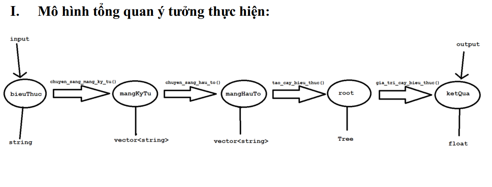

# Calculator

## Mô hình tổng quan

    

## Mô tả ý tưởng thực hiện

Với dữ liệu đầu vào là một biểu thức nhập từ bàn phím thì ta có được 1 biểu
thức với kiểu chuỗi (string).

**Bước 1:** Từ biểu thức kiểu chuỗi có được, ta bắt đầu ta phân tách thành một
mảng string gồm các phần tử toán hạng, toán tử, dấu “(“, dấu “)”.
Vd: chuỗi nhập vào là “2*(100-10) + 40 / (9-(10-3))” sau khi phân tách thành
mảng ta có được một mảng kiểu chuỗi gồm:
`{“2”, “*”, “(“, “100”, “-”, “10”, “)”, “+”, “40”, “/”, “(“, “9”, “-”, “(”, “10”, “-”, “3”, “)”, “)”}`

**Bước 2:** Sau khi có được mảng chuỗi của biểu thức, để thực hiện cài đặt lên
cây và biết được phép tính nào tính trước hay tính sau, thì ta thực hiện chuyển đổi
mảng biểu thức kiểu chuỗi trên thành một mảng biểu thức hậu tố (postfix).
Phương pháp chuyển đổi sang hậu tố: (em đã tìm hiểu và biết được phương
pháp chuyển sang hậu tố được gọi là: Ký pháp nghịch đảo Ba Lan). Với ví dụ trên
em đã giải như hình sau để ra được mảng hậu tố
`{“2”, “100”, “10“, “-”, “*”, “40”, “9”, “10”, “3”, “-”, “-”, “/”, “+”}`

    

**Bước 3:** Sau khi tạo được mảng hậu tố thì tiếp theo ta sẽ dựa theo mảng này để
xây dựng nên một cây biểu thức (Expression tree), với cách duyệt từng phần tử
mảng, kết hợp với stack<tree> để lưu trữ, dưới đây là phương pháp giải bằng tay cho
ví dụ trên:

    

