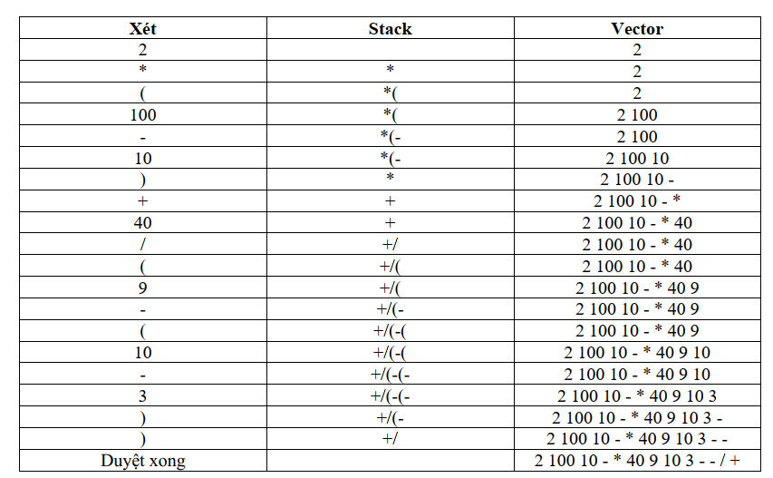

# Tên dự án 

Calculator

## Mô hình tổng quan

    

## Mô tả ý tưởng thực hiện

Với dữ liệu đầu vào là một biểu thức nhập từ bàn phím thì ta có được 1 biểu
thức với kiểu chuỗi (string).
Bước 1: Từ biểu thức kiểu chuỗi có được, ta bắt đầu ta phân tách thành một
mảng string gồm các phần tử toán hạng, toán tử, dấu “(“, dấu “)”.
Vd: chuỗi nhập vào là “2*(100-10) + 40 / (9-(10-3))” sau khi phân tách thành
mảng ta có được một mảng kiểu chuỗi gồm:
{“2”, “*”, “(“, “100”, “-”, “10”, “)”, “+”, “40”, “/”, “(“, “9”, “-”, “(”, “10”, “-”, “3”, “)”, “)”}
Bước 2: Sau khi có được mảng chuỗi của biểu thức, để thực hiện cài đặt lên
cây và biết được phép tính nào tính trước hay tính sau, thì ta thực hiện chuyển đổi
mảng biểu thức kiểu chuỗi trên thành một mảng biểu thức hậu tố (postfix).
Phương pháp chuyển đổi sang hậu tố: (em đã tìm hiểu và biết được phương
pháp chuyển sang hậu tố được gọi là: Ký pháp nghịch đảo Ba Lan). Với ví dụ trên
em đã giải như hình sau để ra được mảng hậu tố
{“2”, “100”, “10“, “-”, “*”, “40”, “9”, “10”, “3”, “-”, “-”, “/”, “+”}

    

## Sử dụng

Hướng dẫn sử dụng dự án của bạn. Bao gồm ví dụ và cách thực hiện các tác vụ cơ bản.

## Cấu trúc thư mục

Giải thích về cấu trúc thư mục của dự án. Đây là nơi bạn có thể giới thiệu về những tệp tin quan trọng trong dự án và nơi lưu trữ dữ liệu.

## Đóng góp

Hướng dẫn người khác cách đóng góp vào dự án của bạn. Nếu bạn chấp nhận pull request, hãy cung cấp hướng dẫn về quy trình và tiêu chí chấp nhận.

## Vấn đề đã biết

Liệt kê các vấn đề đã biết trong dự án, cùng với các yêu cầu bổ sung hoặc hướng dẫn để giải quyết chúng.

## Giấy phép

Đặt thông tin về giấy phép dự án của bạn ở đây. Điều này giúp người dùng biết rằng họ có thể sử dụng dự án theo quy định nào.

## Liên hệ

Thông tin liên hệ của bạn, bao gồm email hoặc tài khoản mạng xã hội để người khác có thể liên hệ với bạn.

---

Sau khi sao chép đoạn mã trên, bạn có thể thay đổi nội dung và thêm các phần khác tùy theo dự án của mình.
